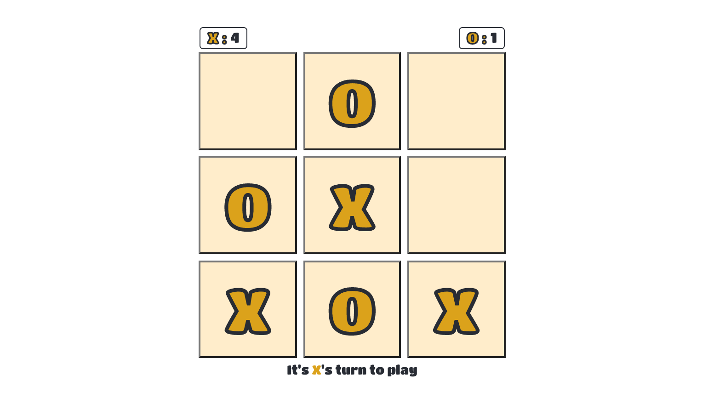

# Tic Tac Toe Game
[Demo](https://tbm85.github.io/demo-tic-tac-toe/)

## Description
A Tic Tac Toe game created with React JS.

This project was bootstrapped with [Create React App](https://github.com/facebook/create-react-app).
This Tic Tac Toe game is a customization made from the [tutorial](https://reactjs.org/tutorial/tutorial.html).

## Resources
* [Titan One Font](https://fonts.google.com/specimen/Titan+One)
* [React Confetti](https://www.npmjs.com/package/react-confetti)

## How to run this app
* Clone: `git clone https://github.com/TBM85/demo-tic-tac-toe.git`
* Enter in the directory: `cd demo-tic-tac-toe`
* Install dependencies: `npm install`
* Start the app: `npm start`

## Instructions
* The game requires two players: "X" and "O".
* The player who places three of his pieces in a horizontal, vertical or diagonal row; win the round.
* The player who first wins 5 rounds, wins the game.

## License
Copyright (c) 2021 Tania Ballester. This project is using [MIT License](LICENSE.md)

